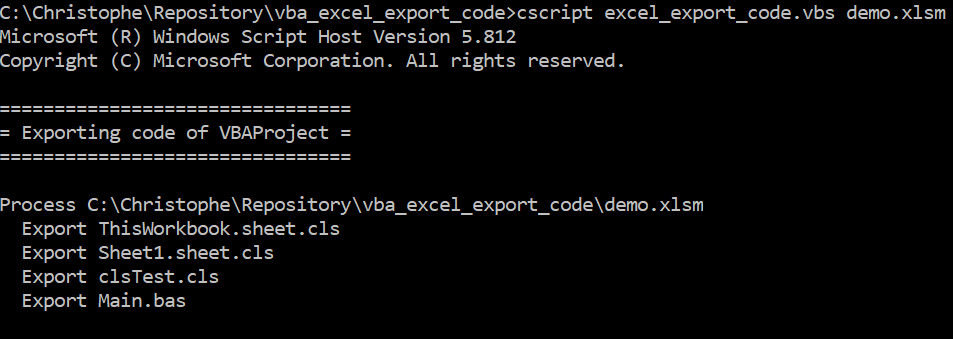

# Excel - Export code to flat files

> Export every code objects (classes, forms, modules and worksheet code) to flat files, in a batch mode. Export the ribbon manifest and icons too.

## Table of Contents

- [Description](#description)
- [Install](#install)
- [Usage](#usage)
- [Author](#author)
- [License](#license)

## Description

This VB script will export all code objects (classes, forms, modules and worksheet macro) from an Excel file (can be `.xlsm` or `.xlam`) to flat files on your disk.

This way, you'll get a quick backup of your code and you'll be able to synchronize your code on a versioning platform like GitHub.

The script will start Excel (hidden way), open the specified file, process every code object and export them, one by one, in a `\src\your_file.xlsm` folder.

The `src` folder will be automatically created if needed and you'll find a sub-folder having the same name of your file (so you can have more than one exported file in the same src folder).

If your Excel file also contains a ribbon, the manifest (i.e. the `xml` of the ribbon) and custom icons will also be exported.

## Install

Just get a copy of the `.vbs` script, perhaps the `.cmd` too (for your easiness) and save them in the same folder of your Excel application (containing the code you want to export).

## Usage

Just edit the `.cmd` file and you'll see how it works: you just need to run the `.vbs` with one parameter, the name of your file.

## Author

Christophe Avonture

## Contribute

PRs not accepted.

## License

[MIT](LICENSE)
